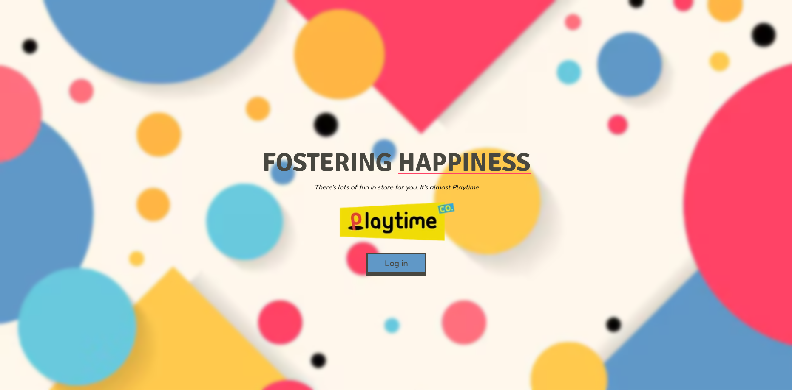
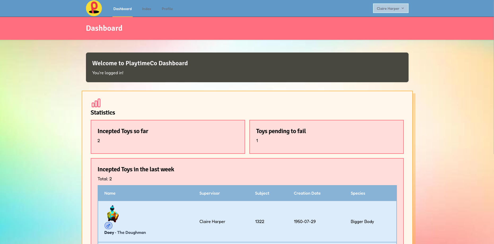
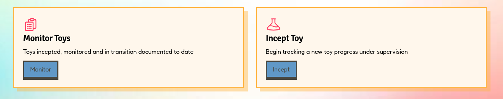
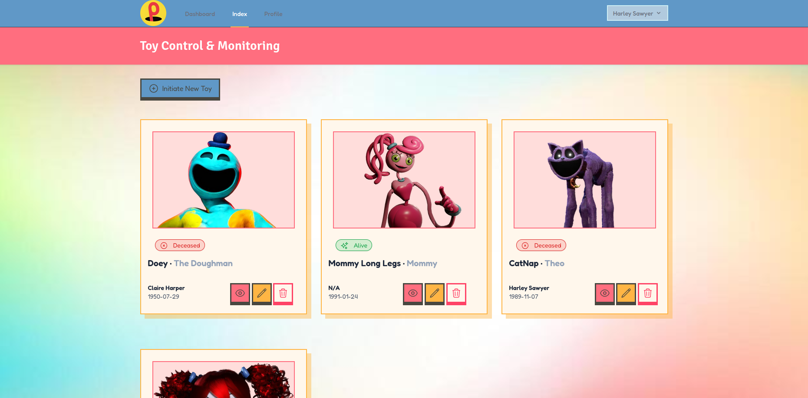
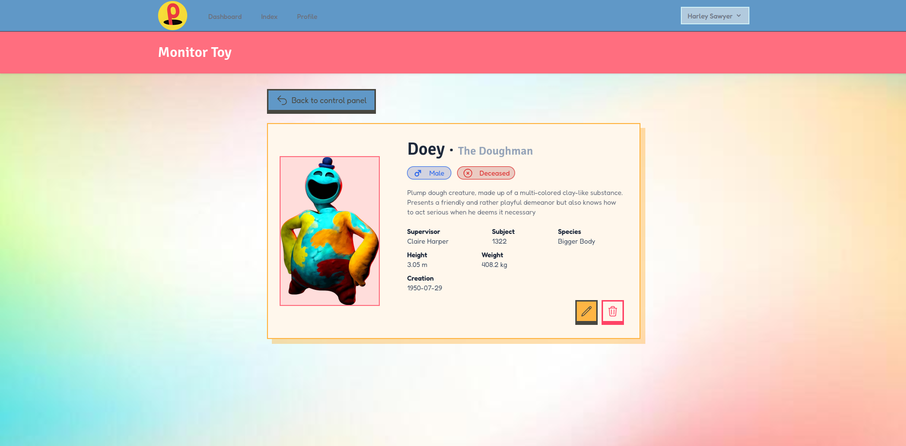
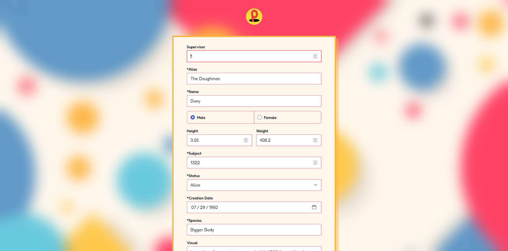
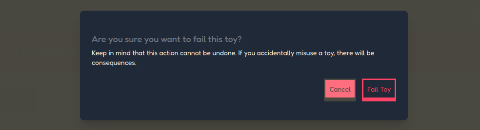
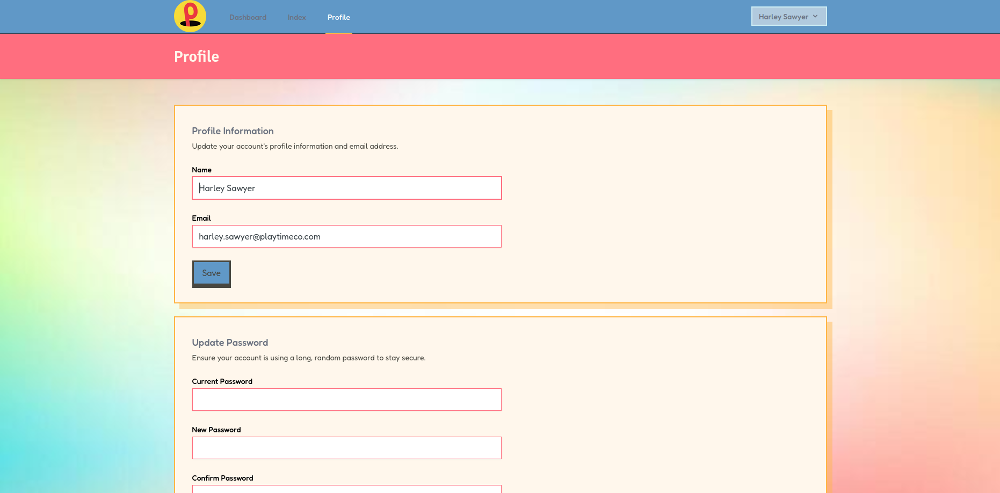
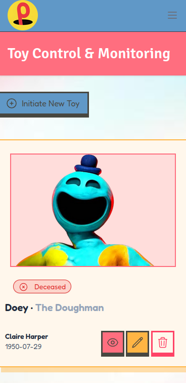

# PlaytimeCo CRUD (Breeze) 🧸
<p align="center">
   <br>
</p>

<p align="center">
    
    
    
    
    
</p>

<p align="center">
    <a href="README.md">🇪🇸 README.md spanish version</a>
</p>

## 🎪 About PlaytimeCo CRUD
Laravel + Breeze (Tailwind) application to manage toys (CRUD) and user profiles. Includes authentication, responsive UI and basic tests.

---

## 🎯 Main Features

- ✅ **Complete CRUD** for toys with validation
- ✅ **Authentication and registration** with Laravel Breeze
- ✅ **User profile management**
- ✅ **Responsive interface** with Tailwind CSS
- ✅ **Success and error notifications** with auto-hide
- ✅ **Server-side form validation**
- ✅ **Robust exception handling**
- ✅ **Seeders** for test data
- ✅ **Custom design** inspired by PlaytimeCo

---

## 🛠️ Technologies Used

- **Backend:** Laravel 10.x
- **Frontend:** Blade, Alpine.js, Tailwind CSS
- **Authentication:** Laravel Breeze
- **Database:** MySQL/MariaDB
- **Package Managers:** Composer, NPM
- **Version Control:** Git

---

## ⚙️ Installation and Setup

### Prerequisites
Make sure you have installed:
- PHP >= 8.1
- Composer
- Node.js >= 16.x and npm
- MySQL/MariaDB or PostgreSQL
- Git

### 1. Clone the repository
```bash
git clone <repo-url> playtimeco-crud-breeze
cd playtimeco-crud-breeze
```

### 2. Configure environment file
Copy the example file and configure the necessary variables:
```bash
cp .env.example .env
```

Edit the `.env` file and configure the following parameters:
```env
# Database configuration
DB_CONNECTION=mysql
DB_HOST=127.0.0.1
DB_PORT=3306
DB_DATABASE=playtimeco-sys
DB_USERNAME=root
#DB_PASSWORD=
```

### 3. Install dependencies
Install PHP and Node.js dependencies:
```bash
# PHP dependencies
composer install

# Node.js dependencies
npm install
```

### 4. Generate application key
```bash
php artisan key:generate
```

### 5. Configure database

Run migrations and seeders:
```bash
# Run migrations
php artisan migrate

# Run specific seeders
php artisan db:seed --class=UserSeeder
php artisan db:seed --class=ToySeeder

# Or run everything at once (refreshes the DB)
php artisan migrate:fresh --seed
```

### 6. Compile assets
For development (with hot-reload):
```bash
npm run dev
```

### 7. Start the server
```bash
php artisan serve
```

The application will be available at: `http://localhost:8000`

### 8. Test credentials
After running the seeders, you can log in with:
```
Email: claire.harper@playtimeco.com
Password: harperpassword123
```

---

## 🔐 Featured Code Snippets

### Exception Handling in ToyController
Ensures database rollback, logs errors and provides user-friendly responses.
```php
// filepath: app/Http/Controllers/ToyController.php
// ...existing code...
public function store(Request $request)
{
    // Create manual validator with all validation rules
    $validator = Validator::make($request->all(), [
        'user_id' => 'nullable|integer',              // Supervisor ID (optional)
        'alias' => 'required|string|max:100',         // Toy alias (required)
        'name' => 'required|string|max:50',           // Toy name (required)
        'gender' => 'required|string',                // Gender (Male/Female)
        'height' => 'nullable|numeric',               // Height in meters (optional)
        'weight' => 'nullable|numeric',               // Weight in kg (optional)
        'subject' => 'required|integer|unique:toys,subject',  // Subject number (unique in DB)
        'status' => 'required|string',                // Status (Alive/Deceased)
        'creation_date' => 'required|date',           // Toy creation date
        'species' => 'required|string|max:100',       // Toy species
        'description' => 'nullable|string|max:500',   // Description (optional)
        'visual' => 'nullable|string|max:500'         // Image URL (optional)
    ]);

    // Check if validation fails
    if ($validator->fails()) {
        return redirect()->back()                      // Return to form
            ->withErrors($validator)                   // Send validation errors
            ->withInput()                              // Keep entered data
            ->with('error', 'Please fix the validation errors.');  // General error message
    }

    // Attempt to create the toy in the database
    try {
        Toy::create($request->all());                  // Create record in toys table
        
        return redirect()->route('toys.index')         // Redirect to listing
            ->with('success', 'Toy created successfully!');  // Success message
            
    } catch (Exception $e) {
        // Catch any error during creation
        return redirect()->back()                      // Return to form
            ->withInput()                              // Keep entered data
            ->with('error', 'Failed to create toy. Please try again.');  // Error message
    }
}
// ...existing code...
```

---

## 📁 Project Structure
```
playtimeco-crud-breeze/
├── app/
│   ├── Http/
│   │   ├── Controllers/
│   │   │   ├── ToyController.php          # Handles CRUD operations for toys (index, create, store, show, edit, update, destroy)
│   │   │   └── ProfileController.php      # Manages user profile operations (view, edit, update, delete account)
|
│   └── Models/
│       ├── Toy.php                        # Eloquent model representing the toys table with fillable fields and relationships
│       └── User.php                       # Eloquent model for users with authentication and profile management
├── database/
│   ├── migrations/                        # Database schema definitions for creating tables and columns
│   └── seeders/
│       ├── UserSeeder.php                 # Populates the database with test user accounts
│       └── ToySeeder.php                  # Populates the database with sample toy records
├── resources/
│   ├── views/
│   │   ├── components/
│   │   │   ├── success-message.blade.php  # Reusable component for displaying success notifications with auto-hide
│   │   │   └── error-message.blade.php    # Reusable component for displaying error notifications with auto-hide
│   │   ├── toys/
│   │   │   ├── index.blade.php            # Displays a list of all toys in card format
│   │   │   ├── create.blade.php           # Form view for creating a new toy
│   │   │   ├── edit.blade.php             # Form view for editing an existing toy
│   │   │   └── show.blade.php             # Detailed view of a single toy with all information
│   │   └── layouts/                       # Master layout templates for consistent page structure
|
├── routes/
│   ├── web.php                            # Defines all web application routes including toy CRUD routes
│   └── auth.php                           # Defines authentication routes (login, register, logout, password reset)
```

---

## 📸 Screenshots

### Welcome Page
<p align="center">
  
</p>

> *Welcome page*

### Main Dashboard
<p align="center">
  
  
</p>

> *Main control panel view with toy listing*

### Toys Listing
<p align="center">
  
</p>

> *Summary view in card format with all registered toys*

### Toy Details
<p align="center">
  
</p>

> *Detailed view of a toy with all its information*

### Create/Edit Toy
<p align="center">

**Create**
  

  **Edit**
  
</p>

> *Form to create or edit a toy*

### Delete Toy
<p align="center">
  
</p>

> *Toy deletion confirmation modal*

### Authentication
<p align="center">
  
</p>

> *Login page with custom design*

### Profile
<p align="center">
  
</p>

> *User profile edit view*

### Responsive Design
<p align="center">
  
</p>

> *Fully adapted interface for mobile devices*

---

## 📝 License

This project is open-source and available under the [MIT license](https://opensource.org/licenses/MIT).